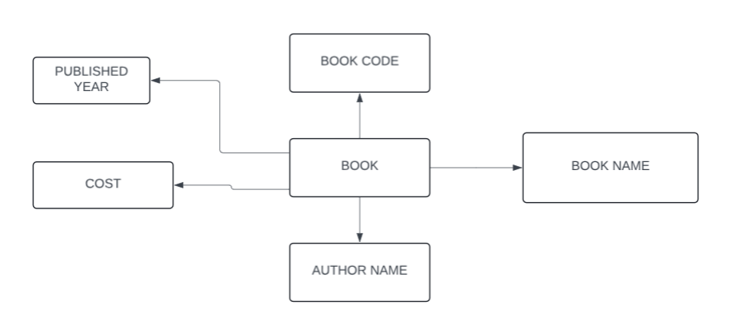
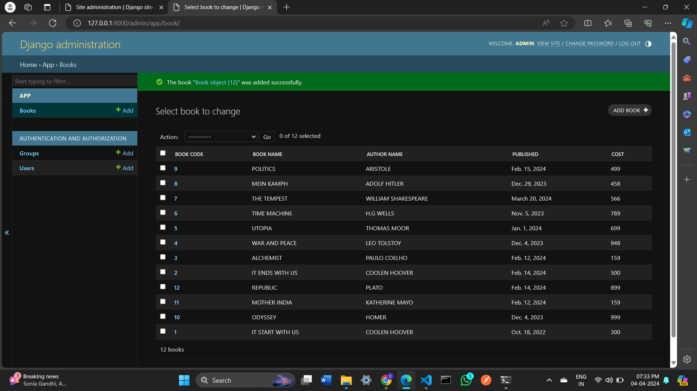

# Ex02 Django ORM Web Application
## Date: 

## AIM
To develop a Django application to store and retrieve data from a Book database using Object Relational Mapping(ORM).

## Entity Relationship Diagram

 ER diagram


## DESIGN STEPS

### STEP 1:
Clone the problem from GitHub

### STEP 2:
Create a new app in Django project

### STEP 3:
Enter the code for admin.py and models.py

### STEP 4:
Execute Django admin and create details for 10 books

## PROGRAM

```
models.py
from django.db import models
from django.contrib import admin

class Book(models.Model):
    Book_code = models.CharField(max_length=20, primary_key=True)
    Book_name = models.CharField(max_length=100)
    Author_name = models.CharField(max_length=100)  
    Published = models.DateField() 
    Cost = models.CharField(max_length=20)

class BookAdmin(admin.ModelAdmin):
    list_display=('Book_code','Book_name','Author_name','Published','Cost')
```
```
admin.py
from django.contrib import admin

from .models import Book, BookAdmin

admin.site.register(Book, BookAdmin)
```

## OUTPUT


## RESULT
Thus the program for creating a database using ORM hass been executed successfully
